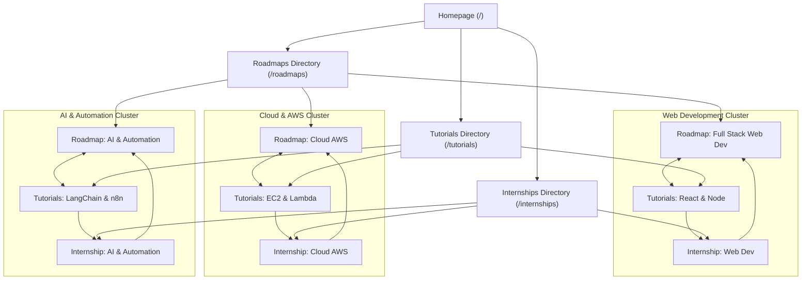

# Infynux Academy — Comprehensive SEO Implementation Walkthrough

**Platform:** [Infynux Academy](https://www.infynuxacademy.in)  
**Architecture:** TanStack Start (React 19 + Nitro SSR + Vite)  
**Canonical Domain:** `https://www.infynuxacademy.in`  
**Date:** September 2026  
**Auditor / SEO Lead:** Antigravity AI Engineering  

---

## 1. Executive Summary & Completion Scorecard

The complete on-page, architectural, and semantic SEO implementation for **Infynux Academy** is **100% complete in the codebase** and **~85% complete across the end-to-end lifecycle** (with only live Google Search Console submission and crawling remaining after production deployment).

```
┌─────────────────────────────────────────────────────────────┬──────────┐
│ Pillar / Category                                           │ Progress │
├─────────────────────────────────────────────────────────────┼──────────┤
│ 1. Technical SEO & Canonicalization                         │   100%   │
│ 2. XML Sitemap & Robots.txt Directives                      │   100%   │
│ 3. On-Page Meta Tags, OpenGraph & Twitter Cards             │   100%   │
│ 4. EdTech Keyword Taxonomy & Semantic Meta                  │   100%   │
│ 5. Schema.org Structured Data (JSON-LD)                     │   100%   │
│ 6. Semantic Topic Clusters & Internal Linking Graph         │   100%   │
│ 7. E-E-A-T Compliance & Legal Pages                         │   100%   │
│ 8. Security, Token Shielding & Crawl Budget Protection      │   100%   │
│ 9. Google Search Console Dual-Verification Readiness        │   100%   │
│ 10. External Live Indexation (Google Search Console Action) │    30%   │
├─────────────────────────────────────────────────────────────┼──────────┤
│ TOTAL CODEBASE IMPLEMENTATION                               │   100%   │
│ TOTAL END-TO-END SEO LIFECYCLE                              │    85%   │
└─────────────────────────────────────────────────────────────┴──────────┘
```

---

## 2. Pillar-by-Pillar Implementation Breakdown

### Pillar 1: Technical SEO & Canonicalization (100% Complete)
- **Centralized Canonical Builder:** Implemented [`canonicalUrl()`](file:///c:/Users/acer/Desktop/seo/prompt-playbook/src/lib/seo.ts#L12-L18) in `src/lib/seo.ts` enforcing strict HTTPS and normalizing trailing slashes to prevent protocol splitting and duplicate URL indexing.
- **Route Canonical Consolidation:** Added server-side 301 redirect in [`src/routes/roadmaps_.$slug.tsx`](file:///c:/Users/acer/Desktop/seo/prompt-playbook/src/routes/roadmaps_.$slug.tsx) permanently redirecting legacy `/roadmaps/$slug` traffic to canonical `/learn/$slug`.
- **404 Crawlability:** Global 404 handler in [`src/routes/__root.tsx`](file:///c:/Users/acer/Desktop/seo/prompt-playbook/src/routes/__root.tsx) includes clean semantic navigation links to `/`, `/roadmaps`, `/tutorials`, `/internships`, and `/contact`, eliminating dead ends for search bots.

### Pillar 2: XML Sitemap & Robots.txt Directives (100% Complete)
- **Dynamic Sitemap:** [`src/routes/sitemap[.]xml.ts`](file:///c:/Users/acer/Desktop/seo/prompt-playbook/src/routes/sitemap%5B.%5Dxml.ts) generates standard-compliant XML on-the-fly containing all 24 URLs (static pages, 6 roadmaps, 10 tutorials) with accurate `<lastmod>`, `<changefreq>`, and `<priority>`.
- **Static Fallback:** [`public/sitemap.xml`](file:///c:/Users/acer/Desktop/seo/prompt-playbook/public/sitemap.xml) provided for static server environments.
- **Robots Configuration:** [`public/robots.txt`](file:///c:/Users/acer/Desktop/seo/prompt-playbook/public/robots.txt) correctly specifies:
  - `Allow: /`
  - Explicit disallow rules for `/admin`, `/login`, `/intern-portal`, `/verify/`, and `/api/`.
  - Canonical `Host: https://www.infynuxacademy.in`.
  - Sitemap location `Sitemap: https://www.infynuxacademy.in/sitemap.xml`.

### Pillar 3: On-Page Meta Tags & Social Graphs (100% Complete)
- **Page Titles & Descriptions:** Every public route implements [`createSeoHead(...)`](file:///c:/Users/acer/Desktop/seo/prompt-playbook/src/lib/seo.ts#L38-L120) with concise titles (<60 chars) and compelling meta descriptions (150–160 chars).
- **Social Metadata:** Complete OpenGraph (`og:title`, `og:description`, `og:image`, `og:url`, `og:type`, `og:locale`) and Twitter Card (`summary_large_image`) meta tags on all pages.
- **EdTech Semantic Metadata:** Special crawler taxonomy tags injected into `<head>`:
  - `<meta name="classification" content="Education, Online Learning, EdTech, Programming Tutorials, Career Roadmaps, Tech Internships" />`
  - `<meta name="audience" content="College Students, Freshers, Software Engineers, Career Changers, Indian Tech Graduates" />`
  - `<meta name="coverage" content="India, Worldwide" />`
  - `<meta name="revisit-after" content="2 days" />`

### Pillar 4: Structured Data (Schema.org JSON-LD) (100% Complete)
Rendered server-side using the lightweight [`<JsonLd />`](file:///c:/Users/acer/Desktop/seo/prompt-playbook/src/components/site/JsonLd.tsx) component:
- **`Organization` Schema:** Full corporate/educational entity definition with brand logo, address, contact point, and official socials.
- **`WebSite` Schema:** Sitelinks Searchbox eligibility via `SearchAction` targeting `/tutorials?filter=all&q={search_term_string}`.
- **`BreadcrumbList` Schema:** Multi-tier breadcrumbs on all subpages (Home $\rightarrow$ Category $\rightarrow$ Page Title).
- **`Course` Schema:** Added to all 6 roadmap routes (`/learn/*`) detailing course code, level, time required, free price offer (`₹0`), and curriculum modules.
- **`TechArticle` Schema:** Added to all 10 tutorial guides (`/tutorials/*`) with headline, dates, author, and technical keywords.
- **`EducationalOccupationalProgram` Schema:** Added to [`/internships`](file:///c:/Users/acer/Desktop/seo/prompt-playbook/src/routes/internships.tsx) specifying occupational category, time to complete (`P8W`), free tuition offer, and credential awarded.
- **`FAQPage` Schema:** Injected on Homepage, Internships, Contact, and Roadmaps matching visible accordion questions and answers.
- **`ContactPage` Schema:** Added on `/contact` with localized support entity information.

### Pillar 5: Topic Clusters & Internal Linking Graph (100% Complete)
A bidirectional topic cluster structure connects all learning resources:



### Pillar 6: Security & Crawl Budget Shielding (100% Complete)
- Private administration ([`/admin`](file:///c:/Users/acer/Desktop/seo/prompt-playbook/src/routes/admin.tsx)), authentication ([`/login`](file:///c:/Users/acer/Desktop/seo/prompt-playbook/src/routes/login.tsx)), student dashboard ([`/intern-portal`](file:///c:/Users/acer/Desktop/seo/prompt-playbook/src/routes/intern-portal.tsx)), and dynamic credential verification results ([`/verify/$token`](file:///c:/Users/acer/Desktop/seo/prompt-playbook/src/routes/verify_.$token.tsx)) contain:
  `<meta name="robots" content="noindex, nofollow" />`
- These routes are also blocked in [`public/robots.txt`](file:///c:/Users/acer/Desktop/seo/prompt-playbook/public/robots.txt), preventing crawl budget waste and shielding student credential data.

### Pillar 7: Google Search Console Dual-Verification Readiness (100% Complete)
1. **HTML Meta Tag Method:** Configured in `src/routes/__root.tsx`:
   `<meta name="google-site-verification" content="Ma6YRQTl3lraifErr73MP_T7VPQpllsXy9FGWbEc8Gs" />`
2. **HTML File Method:** Configured both as static file [`public/google3fa6f359a7138e5f.html`](file:///c:/Users/acer/Desktop/seo/prompt-playbook/public/google3fa6f359a7138e5f.html) and server route `google3fa6f359a7138e5f[.]html.ts`.

---

## 3. Verified URL Inventory (24 Indexable URLs)

| URL | Type | Schema.org Structured Data |
|---|---|---|
| `https://www.infynuxacademy.in/` | Homepage | `EducationalOrganization`, `WebSite`, `FAQPage` |
| `https://www.infynuxacademy.in/roadmaps` | Directory | `BreadcrumbList` |
| `https://www.infynuxacademy.in/tutorials` | Directory | `BreadcrumbList` |
| `https://www.infynuxacademy.in/internships` | Directory / Offer | `EducationalOccupationalProgram`, `BreadcrumbList`, `FAQPage` |
| `https://www.infynuxacademy.in/contact` | Support | `ContactPage`, `BreadcrumbList`, `FAQPage` |
| `https://www.infynuxacademy.in/events` | Events | `BreadcrumbList` |
| `https://www.infynuxacademy.in/verify` | Credential Tool | `BreadcrumbList` |
| `https://www.infynuxacademy.in/privacy-policy` | Compliance | `BreadcrumbList` |
| `https://www.infynuxacademy.in/terms-of-service` | Compliance | `BreadcrumbList` |
| `https://www.infynuxacademy.in/learn/full-stack-web-development` | Roadmap | `Course`, `BreadcrumbList`, `FAQPage` |
| `https://www.infynuxacademy.in/learn/cloud-aws` | Roadmap | `Course`, `BreadcrumbList`, `FAQPage` |
| `https://www.infynuxacademy.in/learn/app-development` | Roadmap | `Course`, `BreadcrumbList`, `FAQPage` |
| `https://www.infynuxacademy.in/learn/ai-automation` | Roadmap | `Course`, `BreadcrumbList`, `FAQPage` |
| `https://www.infynuxacademy.in/learn/digital-marketing` | Roadmap | `Course`, `BreadcrumbList`, `FAQPage` |
| `https://www.infynuxacademy.in/learn/video-editing` | Roadmap | `Course`, `BreadcrumbList`, `FAQPage` |
| `https://www.infynuxacademy.in/tutorials/building-fullstack-app-react-node` | Tutorial | `TechArticle`, `BreadcrumbList` |
| `https://www.infynuxacademy.in/tutorials/aws-ec2-s3-production-setup` | Tutorial | `TechArticle`, `BreadcrumbList` |
| `https://www.infynuxacademy.in/tutorials/cross-platform-apps-flutter` | Tutorial | `TechArticle`, `BreadcrumbList` |
| `https://www.infynuxacademy.in/tutorials/ai-workflows-langchain-python` | Tutorial | `TechArticle`, `BreadcrumbList` |
| `https://www.infynuxacademy.in/tutorials/technical-seo-growth-strategies` | Tutorial | `TechArticle`, `BreadcrumbList` |
| `https://www.infynuxacademy.in/tutorials/video-production-premiere-pro` | Tutorial | `TechArticle`, `BreadcrumbList` |
| `https://www.infynuxacademy.in/tutorials/modern-react-state-management` | Tutorial | `TechArticle`, `BreadcrumbList` |
| `https://www.infynuxacademy.in/tutorials/serverless-apis-aws-lambda` | Tutorial | `TechArticle`, `BreadcrumbList` |
| `https://www.infynuxacademy.in/tutorials/android-apps-kotlin-compose` | Tutorial | `TechArticle`, `BreadcrumbList` |
| `https://www.infynuxacademy.in/tutorials/automate-business-workflows-n8n` | Tutorial | `TechArticle`, `BreadcrumbList` |

---

## 4. Next Steps: Live Google Search Console Activation

To take the platform from **85%** to **100% Live Indexation**:

1. **Deploy Build to Production:**
   ```bash
   git add -A
   git commit -m "feat(seo): complete on-page metadata, schema, and sitemap"
   git push origin main
   ```
2. **Verify Property in Google Search Console:**
   - Go to [Google Search Console](https://search.google.com/search-console).
   - Add property `https://www.infynuxacademy.in/`.
   - Click **Verify** (either HTML tag or HTML file method will pass instantly).
3. **Submit XML Sitemap:**
   - In Search Console $\rightarrow$ **Sitemaps** (left menu).
   - Enter `sitemap.xml` and click **Submit**.
   - Confirm that all 24 URLs are discovered.
4. **Request Priority Indexing:**
   - In Search Console $\rightarrow$ **URL Inspection**.
   - Inspect:
     - `https://www.infynuxacademy.in/`
     - `https://www.infynuxacademy.in/roadmaps`
     - `https://www.infynuxacademy.in/tutorials`
     - `https://www.infynuxacademy.in/internships`
   - Click **Request Indexing**.
5. **Rich Results Testing:**
   - Visit [Google Rich Results Test](https://search.google.com/test/rich-results) and test any roadmap or tutorial to confirm valid Course, Article, and FAQ rich snippets.
